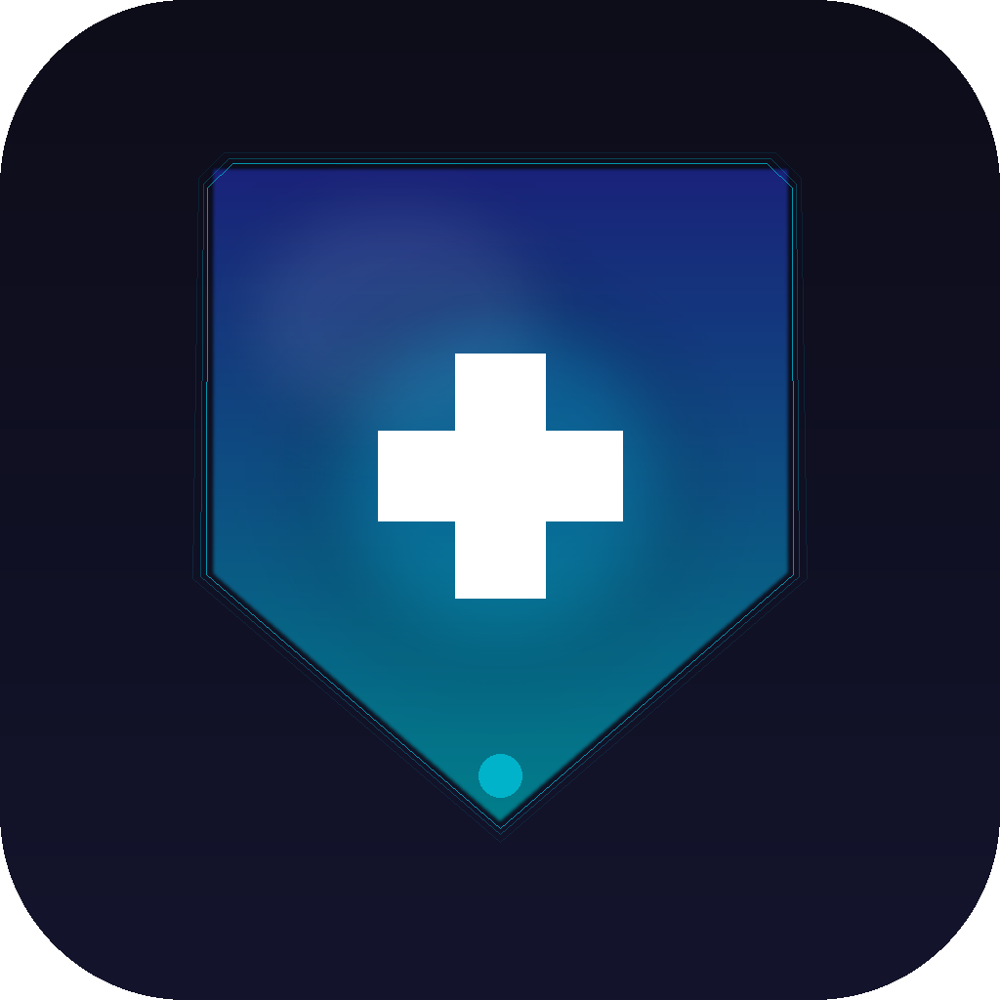

<p align="center">
  
</p>

# AuraSafe

**Offline-First Safety App for Households & Caregivers**

AuraSafe is an Android app built with [Flet (Python)](https://flet.dev/) that combines three safety tools into one:

| Module | Purpose |
|--------|---------|
| **Barcode Product Guardian** | Scan any product barcode for personal health risks, chemical hazards, and disposal guidance |
| **MediQR** | Generate a signed emergency medical profile QR code for first responders |
| **SehatSathi** | Voice-first symptom triage with Red/Yellow/Green urgency classification |

Built for **[Kalpana 6.0: Hack for Humanity](https://ieee.pes.edu/)** — organised by the **IEEE Club, PES University EC Campus**. Designed to work in low-connectivity environments.


## Architecture

```
AuraSafe/
├── assets/
│   └── cpdat_hazards.json        # EPA CPDat chemical hazard database (offline)
├── data/
│   └── db.py                     # SQLite ORM — products cache, user profile, triage history
├── services/
│   ├── barcode_lookup.py         # BarcodeLookup.com API client
│   ├── open_food_facts.py        # Open Food Facts fallback API
│   ├── cpdat_matcher.py          # Ingredient → CPDat hazard matching (exact/fuzzy)
│   ├── risk_scorer.py            # Weighted risk score aggregator (1–10)
│   ├── green_score.py            # Environmental/disposal scoring
│   ├── triage.py                 # Symptom classifier (Red/Yellow/Green)
│   ├── mediqr.py                 # QR code generation & decoding
│   ├── camera_util.py            # Barcode/QR detection via OpenCV (desktop)
│   └── voice_recog.py            # Vosk-based speech recognition (desktop)
├── ui/
│   ├── home.py                   # Home screen
│   ├── scanner.py                # Barcode scanner screen
│   ├── product_card.py           # Product risk result card
│   ├── mediqr_screen.py          # Medical profile & QR management
│   ├── sehatsathi_screen.py      # Symptom triage UI
│   └── theme.py                  # Flet design system
├── pyproject.toml                # Flet build configuration
└── requirements.txt              # Python dependencies
```

### Risk Score Formula

```
Overall Score (1–10) =
    Health Score    × 0.50   (CPDat ingredient hazard evidence)
  + Env Score       × 0.30   (disposal & environmental impact)
  + Personal Risk   × 0.20   (allergy / medication conflict via MediQR)

Verdict:  1–3 = SAFE   |   4–6 = CAUTION   |   7–10 = DANGER
```


## Getting Started

### Prerequisites

- Python 3.10+
- [Flet CLI](https://flet.dev/docs/getting-started/) — `pip install flet`
- Android SDK (for building APK)

### Install dependencies

```bash
pip install -r requirements.txt
```

### Configure API key

Copy the example config and add your [BarcodeLookup API key](https://www.barcodelookup.com/api):

```bash
cp config.example.json config.json
# Edit config.json and set your barcode_api_key
```

### Regenerate the app icon (optional)

```bash
python scripts/generate_icon.py
```

### Voice recognition model (optional — desktop only)

SehatSathi's voice capture uses Vosk. Download the small English model and place it at:

```
assets/models/vosk-model-small-en-us/
```

Download: https://alphacephei.com/vosk/models → `vosk-model-small-en-us-0.15`

> Voice recognition is disabled on Android builds. The app falls back to text input automatically.

### Run (desktop/dev)

```bash
flet run main.py
```

### Build Android APK

```bash
flet build apk
```


## Data Sources

| Source | Usage |
|--------|-------|
| [BarcodeLookup.com](https://www.barcodelookup.com/api) | Resolve UPC/EAN barcode → product metadata |
| [Open Food Facts](https://world.openfoodfacts.org/data) | Food product fallback with allergen data |
| [EPA CPDat](https://comptox.epa.gov/dashboard/chemical-list/CPDAT) | Ingredient → chemical hazard mapping (bundled offline) |


## Safety Guardrails

- No medical diagnosis is made or implied.
- High-severity symptoms (RED triage) always escalate to professional emergency services.
- All risk outputs display confidence labels and data provenance.
- Unknown products are flagged explicitly — no hallucinated certainty.


## Tech Stack

- **UI:** [Flet](https://flet.dev/) (Python → Flutter → Android)
- **Storage:** SQLite (local-first, encrypted sensitive fields)
- **Speech:** [Vosk](https://alphacephei.com/vosk/) (offline, desktop)
- **Barcodes:** OpenCV + pyzbar (desktop), FilePicker (Android)
- **Hazard DB:** EPA CPDat (bundled JSON, offline)


## Team

Built at **Kalpana 6.0: Hack for Humanity** by the **IEEE Club, PES University EC Campus**.

| Name | Title | Contributions |
|------|-------|---------------|
| Yashwanth Karthik | Full Stack & Mobile Developer | Architecture, Android build pipeline, camera integration, project lead |
| Janaki Niharika | Backend Developer | MediQR module, SQLite data layer, offline caching strategy |
| Siddhi S Navale | Data & Backend Engineer | Barcode lookup, risk scoring engine, EPA CPDat hazard integration |
| Tanusha Reva | Frontend Developer & UI/UX Designer | SehatSathi triage UI, voice recognition, app theme & design system |


## License

MIT
---
